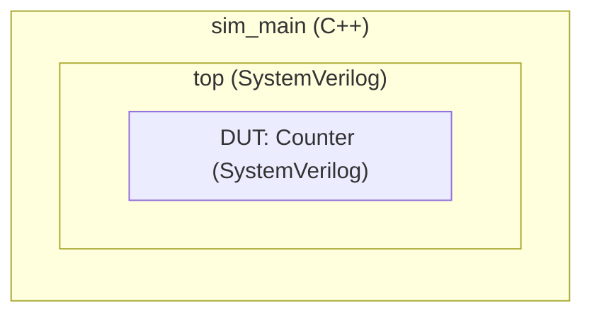

# verilator-example

A simple example of how to use Verilator.

## Prerequisites

- Verilator 5.006 or later
- C++ compiler
- GNU Make
- VCD file viewer, e.g. GTKwave (only for viewing signal dumps)

## Structures

The hierarchy of modules are shown below:



- Counter: the DUT, a simple counter in SystemVerilog
- top: the lower part of the testbench in SystemVerilog
- sim_main: the upper part of the testbench in C++

The directory structure is shown below:

- src/ (includes the DUT)
  - Counter.sv
- sim/ (includes the testbench)
  - Makefile
  - sim_main.cpp
  - top.sv

## How to build and simulate

Run `make` in sim/ directory to build and simulate.

```shell
$ cd sim
$ make
verilator --cc --exe --build -j 0 -Wall --trace sim_main.cpp top.sv ../src/Counter.sv
make[1]: Entering directory '.../verilator-example/sim/obj_dir'
...
make[1]: Leaving directory '.../verilator-example/sim/obj_dir'
./obj_dir/Vtop +trace
Start tracing to dump.vcd...
- top.sv:41: Verilog $finish
```

If successfull, a signal dump file `dump.vcd` will be created in sim/ directory.
